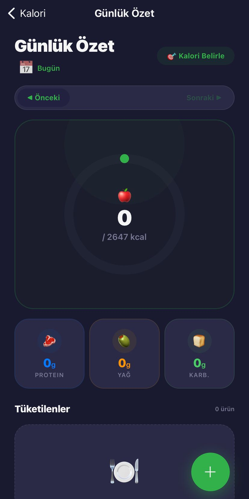
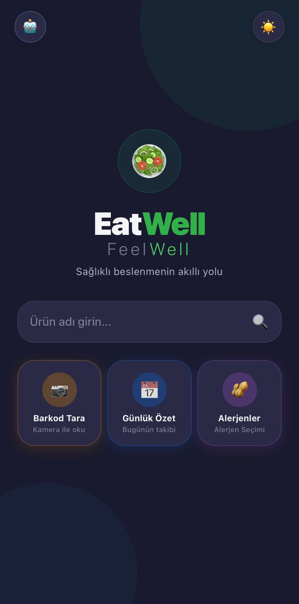
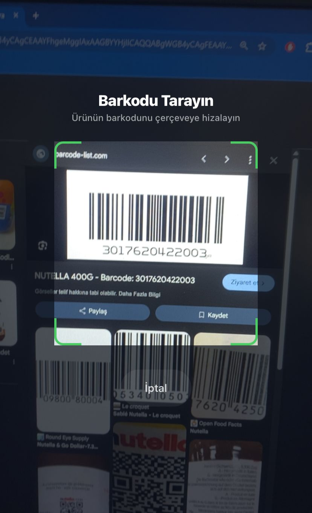
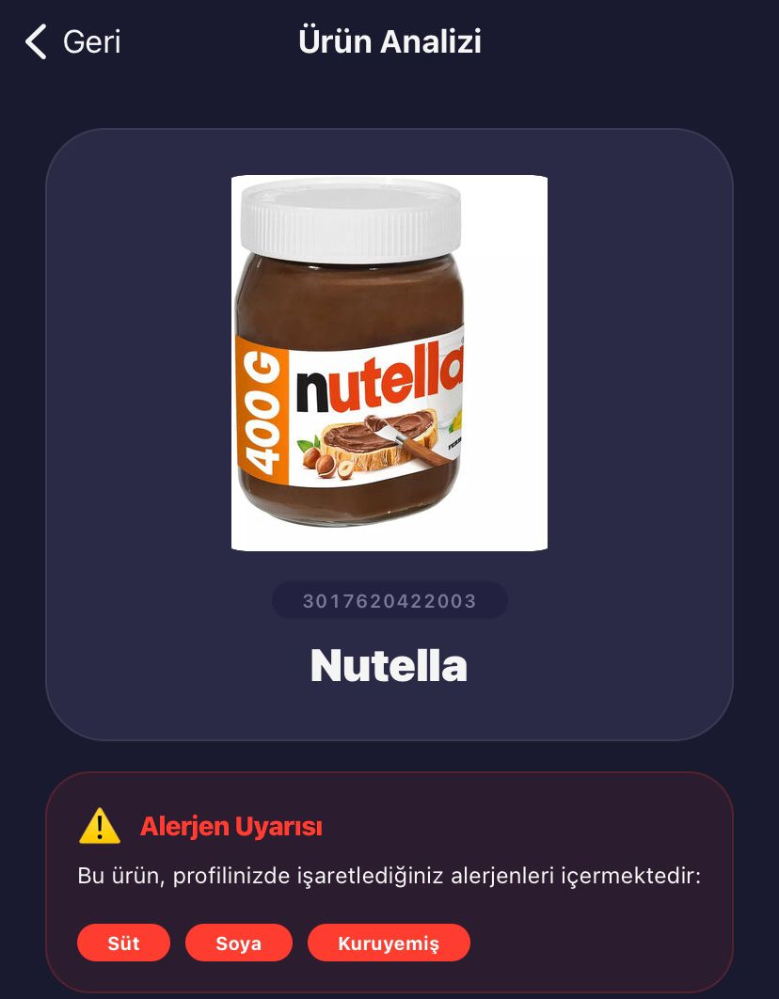
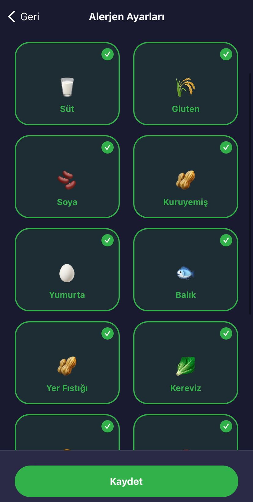
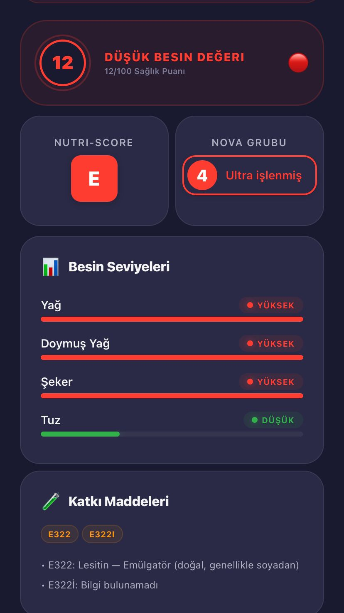
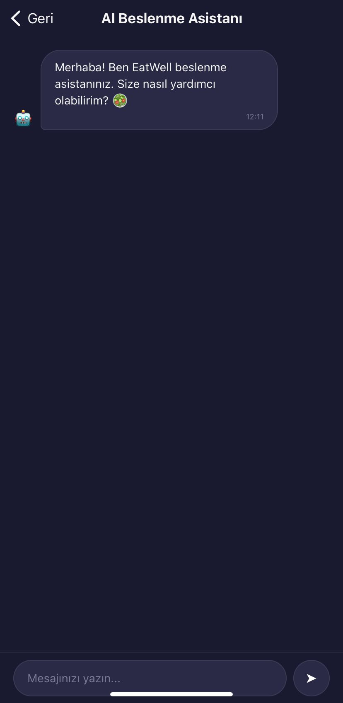

# EatWell (Mobile & Backend) 🥗📱

EatWell is a comprehensive mobile application and backend service designed to help users track their daily nutrition, calories, and macronutrients. It allows users to scan product barcodes to instantly access detailed nutritional information, including Nutri-Score, NOVA group, and allergen warnings. 

The project aims to promote healthier eating habits by providing actionable insights into daily food consumption.

---

## 🚀 Features

- **Barcode Scanning:** Instantly retrieve nutritional data for over 2 million products via the OpenFoodFacts API.
- **Calorie & Macro Tracking:** Set daily goals based on BMR and TDEE formulas, and log daily consumption (Protein, Fat, Carbs).
- **Health Indicators:** View Nutri-Score, NOVA Group classification, and Eco-Score for scanned items.
- **Detailed Insights:** See the amount of sugar, saturated fat, and salt per 100g, visualized with intuitive custom UI components.
- **Allergen Warnings:** Get alerted if a scanned product contains allergens or additives.
- **Custom Goal Setting:** Personalize daily calorie targets based on your weight, height, age, gender, and activity level.

---

## 🛠 Tech Stack

### Frontend (Mobile App)
- **Framework:** React Native & Expo
- **Language:** TypeScript
- **State Management & Data Fetching:** React Hooks, Axios
- **Navigation:** React Navigation (Native Stack)
- **UI Components:** Custom components, `react-native-svg`, `expo-camera`, custom icons & charts.

### Backend (API)
- **Framework:** .NET 8 (C#) Web API
- **Architecture:** Onion / Clean Architecture
- **Database:** PostgreSQL
- **ORM:** Entity Framework Core (EF Core)
- **External APIs:** OpenFoodFacts API (for barcode product data)
- **AI Integration:** Google Gemini API integration (for intelligent food analysis/recommendations)
- **Real-time:** SignalR

---

## 📸 Screenshots

*(Add your screenshots to the `docs/screenshots/` folder and uncomment the lines below)*

| App Screen | App Screen | App Screen | App Screen |
| :---: | :---: | :---: | :---: |
|  |  |  |  |
|  |  |  |  |

---

## 💻 Installation & Getting Started

### Prerequisites
- Node.js (v18+)
- Expo CLI
- .NET 8 SDK
- PostgreSQL Server

### 1. Backend Setup (.NET / PostgreSQL)

1. Open the `/eatwellfeelwell` directory in your IDE (Visual Studio / Rider / VS Code).
2. Configure your PostgreSQL connection string in `API/appsettings.json`:
   ```json
   "ConnectionStrings": {
     "PostgreSQL": "Host=localhost;Port=5432;Database=EatWellFeelWellDb;Username=postgres;Password=yourpassword"
   }
   ```
3. Run Entity Framework migrations to create the database:
   ```bash
   dotnet ef database update --project Infrastructure/Persistence --startup-project API
   ```
4. Start the API project:
   ```bash
   cd API
   dotnet run
   ```

### 2. Frontend Setup (React Native / Expo)

1. Navigate to the mobile app directory:
   ```bash
   cd EatWellMobile
   ```
2. Install dependencies:
   ```bash
   npm install
   ```
3. Ensure the `API_CONFIG` in `src/constants/api.ts` points to your backend URL (e.g., `http://localhost:5000` or your local IP for mobile testing).
4. Start the Expo development server:
   ```bash
   npx expo start
   ```
5. Scan the QR code presented in the terminal with the Expo Go app on your physical device, or press `a` or `i` to open in an Android/iOS emulator.

---

## 📂 Folder Structure Highlights

### `EatWellMobile` (Frontend)
- `src/components/` - Reusable UI elements (HealthBadges, GoalChart, DetailPill)
- `src/screens/` - Main application pages (DailySummary, CalorieGoal, AnalysisScreen)
- `src/services/` - Logic for HTTP requests (dailyLogService, productService)
- `src/types/` - Shared TypeScript interfaces 

### `eatwellfeelwell` (Backend)
- `API/` - Controllers, Middlewares, and application entry point
- `Core/` - Domain entities, DTOs, and Service interfaces
- `Infrastructure/` - Service implementations, External API (OpenFoodFacts) connectors
- `Persistence/` - EF Core DbContext, Repositories, Migrations

---

## 🤝 Contributing
Contributions, issues, and feature requests are welcome!

## 📝 License
This project is licensed under the MIT License.
