# EatWell - AI-Powered Nutrition & Calorie Tracker 🍏🤖


EatWell is a next-generation calorie tracking and nutrition assistant. Say goodbye to manual calorie entry! Snap a photo of your food, scan a barcode, and let Artificial Intelligence do the rest. Protect your health with dynamic Allergen Alerts, and consult your personal AI Dietitian for daily advice.

---

## ✨ Key Features

* **📷 AI Vision Food Analysis:** Take a picture of your meal! Our backend forwards the image to **Mistral AI (Pixtral-12b)**, which instantly predicts the food type and calculates its Calories, Protein, Carbohydrates, and Fats.
* **🔎 Instant Barcode Scanner:** Integrated with the global **OpenFoodFacts API**. Scan any packaged food to get its exact nutritional values and ingredients.
* **⚠️ Smart Allergen Alerts (Soft Alert System):** Save your allergies (e.g., Gluten, Milk, Peanuts). Whenever you scan or photograph a food containing these allergens, the system cross-matches the ingredients and displays a huge warning!
* **💬 AI Chatbot Dietitian:** Ask questions like *"Is this suitable for my pre-workout?"* or *"Can I eat this late at night?"* The AI assistant knows your allergen profile and gives contextual, personalized answers.
* **📊 Daily Targets & Dynamic UI:** Beautiful, smooth, and responsive UI built with **React Native Reanimated** and Glassmorphism design principles. Tracks your daily macro goals automatically.

---

## 📱 Screenshots

<div align="center">
  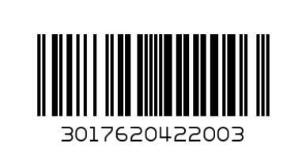
  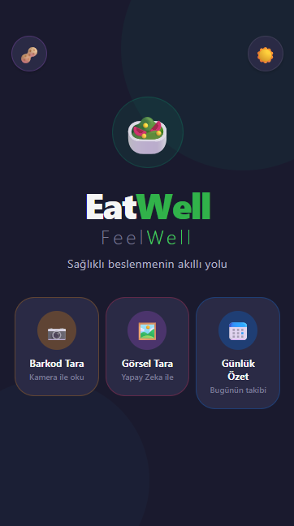
  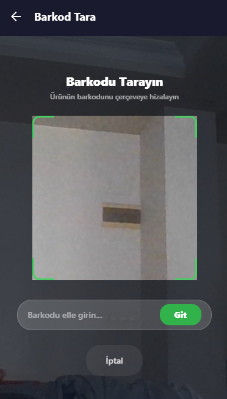
  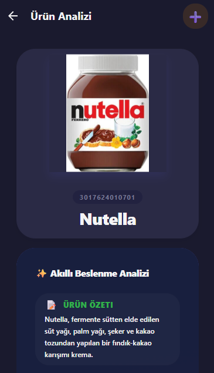
</div>
<br>
<div align="center">
  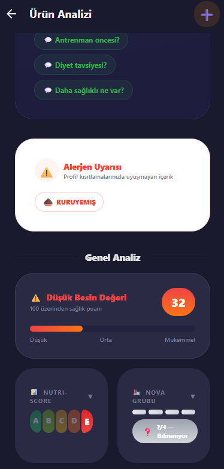
  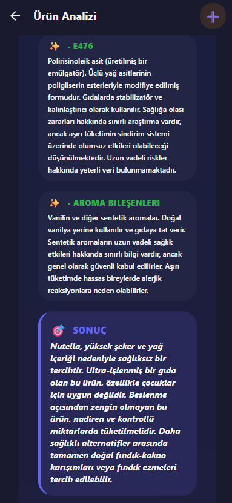
  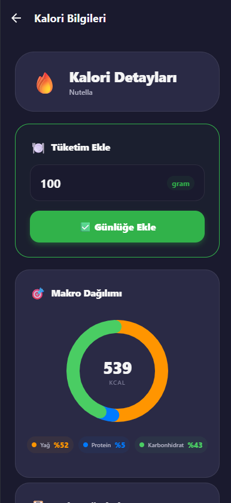
  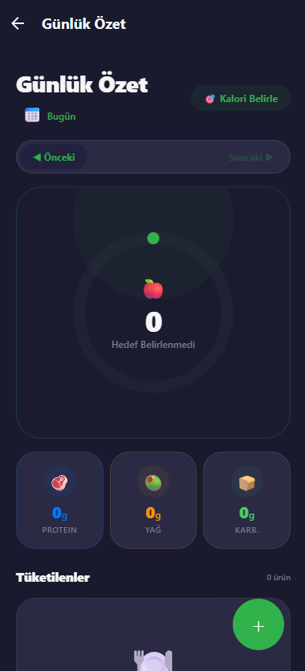
</div>
<br>
<div align="center">
  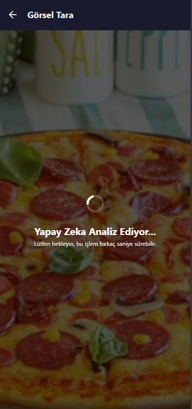
  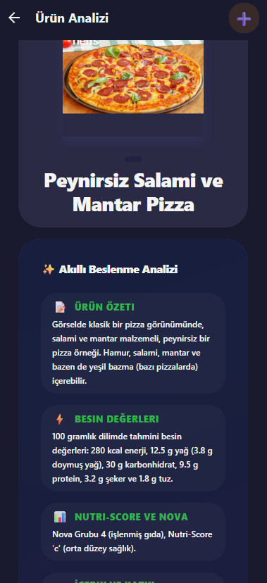
  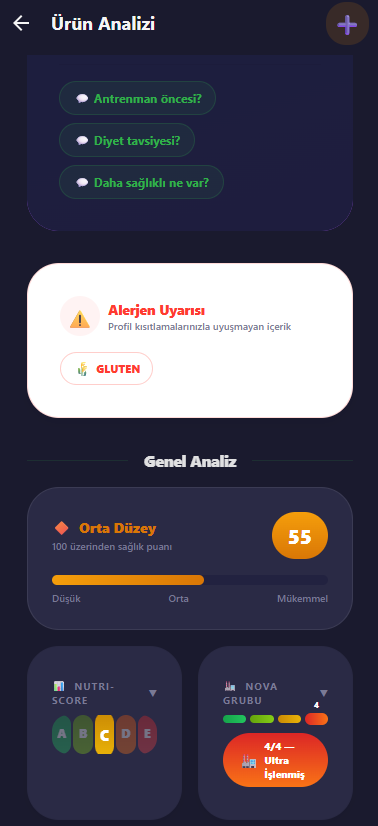
</div>

---

## 🏗️ Architecture & Tech Stack

This project strictly adheres to **Clean Architecture (Onion Architecture)** principles, ensuring high testability, maintainability, and loosely-coupled components.

### Backend (.NET 9)
- **Domain Layer:** Pure entities (`CalorieGoal`, `DailyLog`, `UserAllergen`).
- **Application Layer:** Use Cases, Interfaces, and DTOs.
- **Infrastructure Layer:** Entity Framework Core, PostgreSQL, Mistral AI REST Client.
- **API / Presentation Layer:** RESTful endpoints for the mobile client.
- **Design Patterns:** Generic Repository Pattern, Unit of Work, Dependency Injection (IoC).

### Frontend (React Native & Expo)
- **Framework:** React Native with Expo Toolchain (Camera, Image Picker, Constants).
- **Styling:** Custom StyleSheet system with modern design systems (Glassmorphism, dark/light themes).
- **Network:** `axios` for centralized API requests.
- **Dynamic Networking:** Automatically fetches the Expo Dev Server's IP (`expo-constants`) so you never have to hardcode your local IP address again!

### DevOps
- **Docker & Docker Compose:** The entire backend and PostgreSQL database are containerized for one-click deployment.

---

## 🚀 Getting Started

### 1. Backend Setup
1. Open the `eatwellfeelwell` directory.
2. In `appsettings.json`, insert your **Mistral API Key**.
3. Run the backend via Docker or local .NET SDK:
   ```bash
   # Run with Docker Compose
   docker-compose up -d --build
   
   # Or run locally using .NET CLI
   dotnet run
   ```

### 2. Frontend Setup
1. Navigate to the `EatWellMobile` directory.
2. Install dependencies:
   ```bash
   npm install
   ```
3. Start the Expo server:
   ```bash
   npx expo start
   ```
4. Open the **Expo Go** app on your physical iOS/Android device and scan the QR code. *(Thanks to the dynamic IP configuration, your phone will automatically connect to your PC's backend!)*

---

## 💡 About The Developers
Developed as a graduation project at **Tekirdağ Namık Kemal University, Computer Engineering Department** by **Melih Esen** & **Tarık Gezici**, under the supervision of **Dr. Ahmet Saygılı**. 

*We believe tracking your health shouldn't be a tedious chore. It should be smart, fast, and beautiful.* 🌟
