# EatWell 🍽️

EatWell, günlük beslenme takibini sadeleştiren mobil bir beslenme asistanıdır. Kullanıcı; hedeflerini oluşturur, öğünlerini ve suyunu takip eder, barkod veya fotoğrafla besin analizi yapar, alerjenlerini yönetir ve elindeki malzemelerden Türkçe tarifler oluşturur.

<table><tr>
<td valign="top">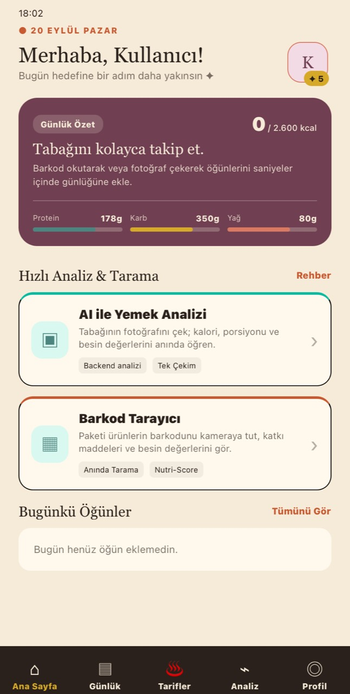</td>
<td valign="top">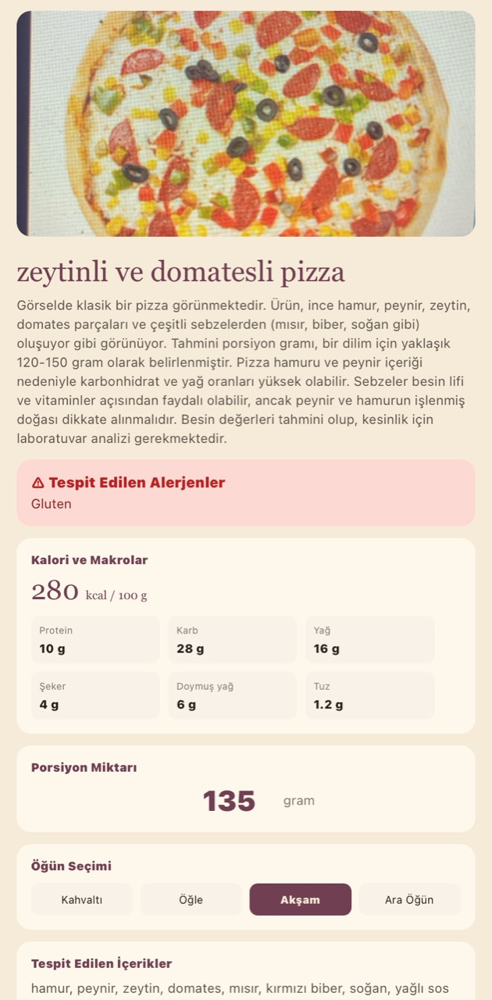</td>
<td valign="top">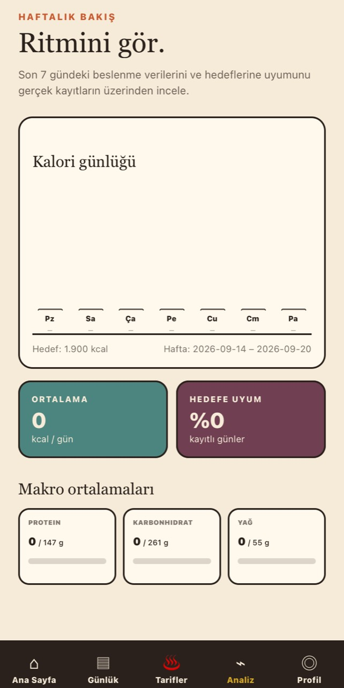</td>
</tr></table>

## ✨ Özellikler

- 🔐 Firebase Authentication ile kayıt, giriş, çıkış ve kalıcı oturum
- 🧍 Profil: ad soyad, yaş, kilo, boy ve cinsiyet
- 🎯 Manuel veya AI destekli kalori, makro ve su hedefi
- 🥜 Alerjen profili ve ürünlerde alerjen uyarıları
- 📅 Tarihe bağlı günlük kayıt ve geçmiş günlere erişim
- 🍽️ Kahvaltı, öğle, akşam ve ara öğün yönetimi
- 💧 Günlük su takibi
- 🏷️ Barkod tarama, barkodu elle girme ve Open Food Facts verisi
- 📷 Kamera veya galeriden görsel yemek analizi
- 🤖 Mistral ile Türkçe görsel analiz ve tarif üretimi
- 🥕 Malzemelerle tarif oluşturma veya yemek fotoğrafından tarif bulma
- 📚 Tarif kaydetme, detayını açma ve silme
- 📊 Backend’den gelen haftalık kalori/makro analizi
- 🛡️ Rate limit, timeout, retry ve circuit breaker koruması

## 🧱 Mimari

Proje, sorumlulukları ayrılmış katmanlı bir .NET backend ve Expo/React Native mobil istemciden oluşur.

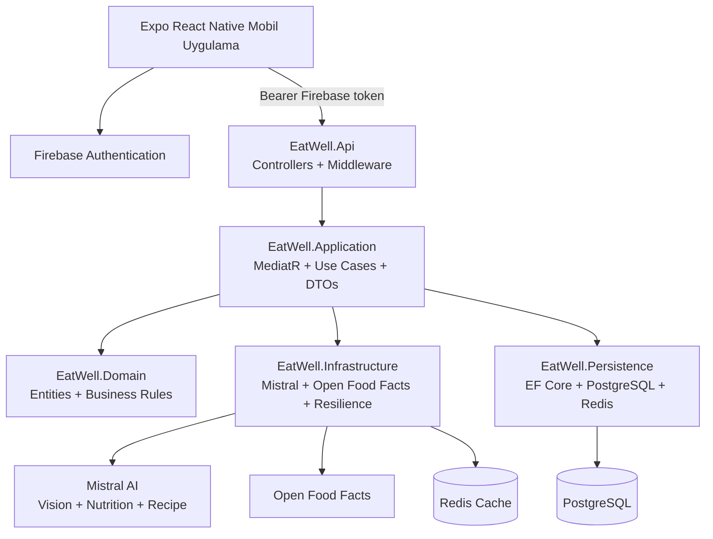
```mermaid
flowchart TB
    Mobile[Expo React Native Mobil Uygulama]
    Auth[Firebase Authentication]
    Api[EatWell.Api\nControllers + Middleware]
    App[EatWell.Application\nMediatR + Use Cases + DTOs]
    Domain[EatWell.Domain\nEntities + Business Rules]
    Infra[EatWell.Infrastructure\nMistral + Open Food Facts + Resilience]
    Persistence[EatWell.Persistence\nEF Core + PostgreSQL + Redis]
    Mistral[Mistral AI\nVision + Nutrition + Recipe]
    OFF[Open Food Facts]
    DB[(PostgreSQL)]
    Cache[(Redis Cache)]

    Mobile -->|Bearer Firebase token| Api
    Mobile --> Auth
    Api --> App
    App --> Domain
    App --> Infra
    App --> Persistence
    Infra --> Mistral
    Infra --> OFF
    Infra --> Cache
    Persistence --> DB
```

### Backend istek akışı

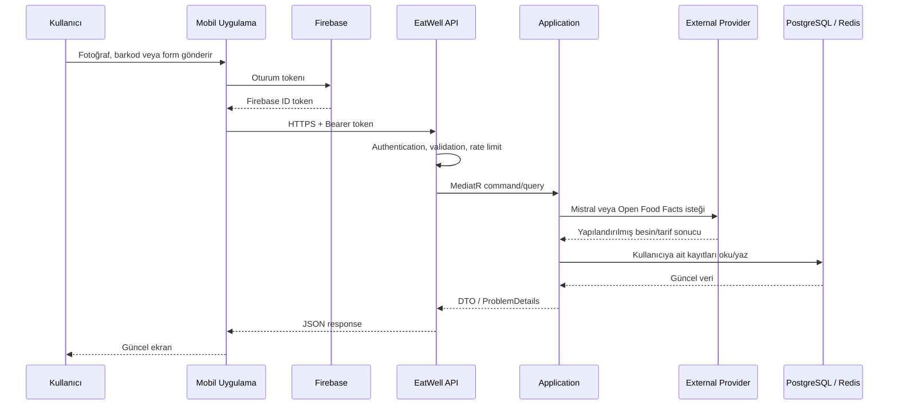
```mermaid
sequenceDiagram
    participant U as Kullanıcı
    participant M as Mobil Uygulama
    participant F as Firebase
    participant A as EatWell API
    participant C as Application
    participant X as External Provider
    participant D as PostgreSQL / Redis

    U->>M: Fotoğraf, barkod veya form gönderir
    M->>F: Oturum tokenı
    F-->>M: Firebase ID token
    M->>A: HTTPS + Bearer token
    A->>A: Authentication, validation, rate limit
    A->>C: MediatR command/query
    C->>X: Mistral veya Open Food Facts isteği
    X-->>C: Yapılandırılmış besin/tarif sonucu
    C->>D: Kullanıcıya ait kayıtları oku/yaz
    D-->>C: Güncel veri
    C-->>A: DTO / ProblemDetails
    A-->>M: JSON response
    M-->>U: Güncel ekran
```

### Katmanlar

| Katman | Sorumluluk |
|---|---|
| `EatWell.Api` | Controller’lar, Firebase authentication, CORS, rate limit, Swagger ve hata yönetimi |
| `EatWell.Application` | Use case’ler, MediatR handler’ları, DTO’lar, validator’lar ve interface’ler |
| `EatWell.Domain` | Profil, hedef, günlük kayıt ve tarif entity’leri |
| `EatWell.Infrastructure` | Mistral, Open Food Facts, Redis cache ve dış HTTP çağrıları |
| `EatWell.Persistence` | EF Core `DbContext`, PostgreSQL repository’leri ve migration’lar |
| `mobile-app` | Expo/React Native ekranları, API client, navigasyon ve mobil UI |

## 🛠️ Teknolojiler

| Alan | Teknoloji |
|---|---|
| Mobil | React Native, Expo SDK 57, TypeScript |
| Navigasyon | React Navigation Bottom Tabs |
| Kimlik | Firebase Authentication |
| Backend | ASP.NET Core / .NET 9 |
| Mimari | Clean Architecture yaklaşımı, MediatR, CQRS tarzı handler’lar |
| Veritabanı | PostgreSQL, Entity Framework Core |
| Cache | Redis |
| AI | Mistral API; vision, beslenme hedefi ve tarif üretimi |
| Besin verisi | Open Food Facts |
| API dokümantasyonu | Swagger / OpenAPI / Swashbuckle |
| Validasyon | FluentValidation |

## 📱 Mobil kullanıcı akışı

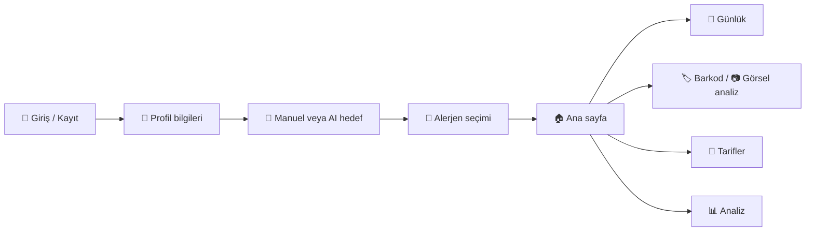
```mermaid
flowchart LR
    Auth[🔐 Giriş / Kayıt] --> Profile[🧍 Profil bilgileri]
    Profile --> Goal[🎯 Manuel veya AI hedef]
    Goal --> Allergens[🥜 Alerjen seçimi]
    Allergens --> Home[🏠 Ana sayfa]
    Home --> Daily[📅 Günlük]
    Home --> Scan[🏷️ Barkod / 📷 Görsel analiz]
    Home --> Recipes[🍳 Tarifler]
    Home --> Insights[📊 Analiz]
```

### Hedef belirleme

AI hedef akışı aktivite seviyesi ve hedef seçimine göre kalori, protein, karbonhidrat, yağ ve su hedefi önerir. Kullanıcı sonucu onayladığında AI hedefi aktif hedef olur. Daha sonra manuel kayıt yapılırsa manuel hedef AI hedefinin yerine geçer; tekrar AI sonucu onaylanırsa manuel hedefin yerine geçer.

<table><tr>
<td valign="top">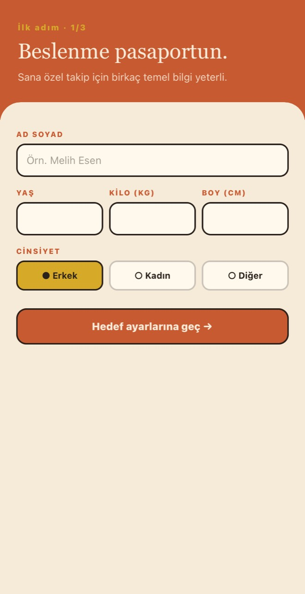</td>
<td valign="top">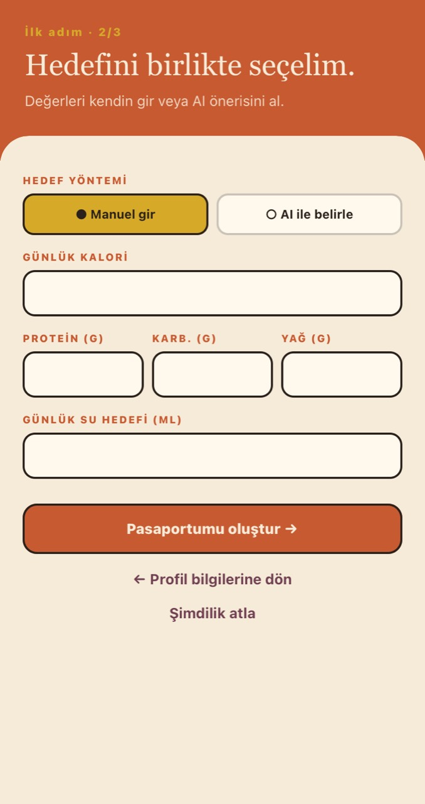</td>
<td valign="top">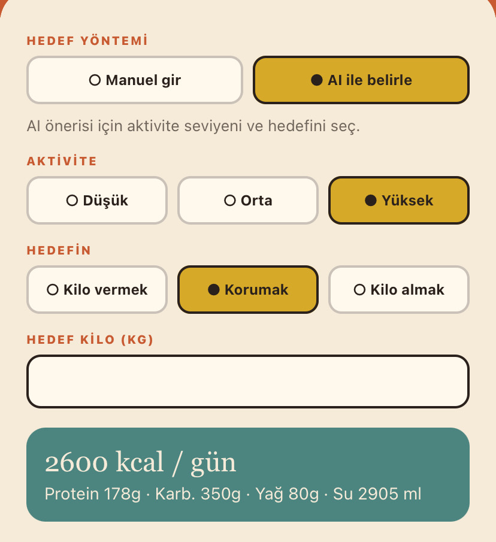</td>
<td valign="top">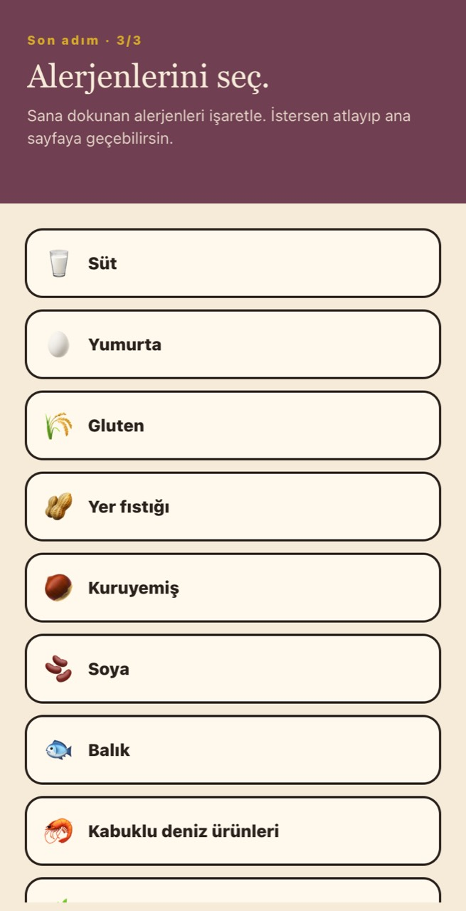</td>
</tr></table>

### Günlük takip

Günlük ekranı seçilen tarihe göre backend’den özet, öğün, makro ve su verilerini çeker. Bir besin eklenince, düzenlenince veya silinince ekran yeniden backend’den yüklenir; grafikler ve toplamlar güncel kalır.

<table><tr>
<td valign="top"></td>
<td valign="top"></td>
<td valign="top">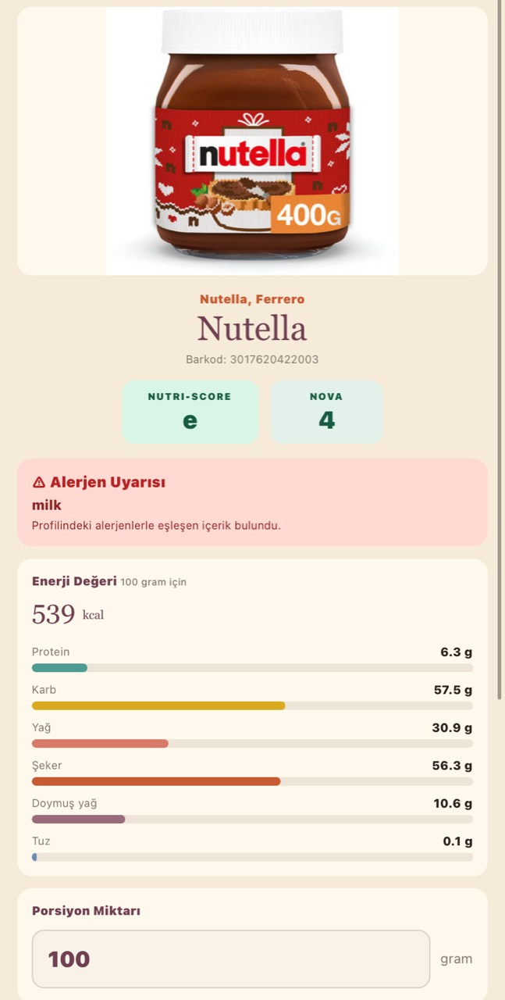</td>
</tr></table>

### AI görsel analiz

Kamera veya galeri görseli mobilde sıkıştırılır, API’ye base64 olarak gönderilir. Backend görseli Mistral Vision provider’ına iletir ve yapılandırılmış JSON sonucu döndürür:

- ürün/yemek adı
- Türkçe açıklama ve tavsiyeler
- kalori ve makrolar
- tahmini porsiyon
- tespit edilen içerikler
- alerjenler

<table><tr>
<td valign="top"></td>
<td valign="top"></td>
</tr></table>

### Tarifler

Tarifler sekmesinde iki backend akışı bulunur:

1. **Tarif Bul:** Kamera veya galeriden yemek fotoğrafı gönderilir.
2. **Tarif Oluştur:** Kullanıcı malzemeleri girer ve AI Türkçe tarif üretir.

Tarif sonucu kaydedilmezse sekmeden çıkarken temizlenir. Kaydedilen tarifler backend’de tutulur; tekrar açılabilir ve silinebilir.

<table><tr>
<td valign="top">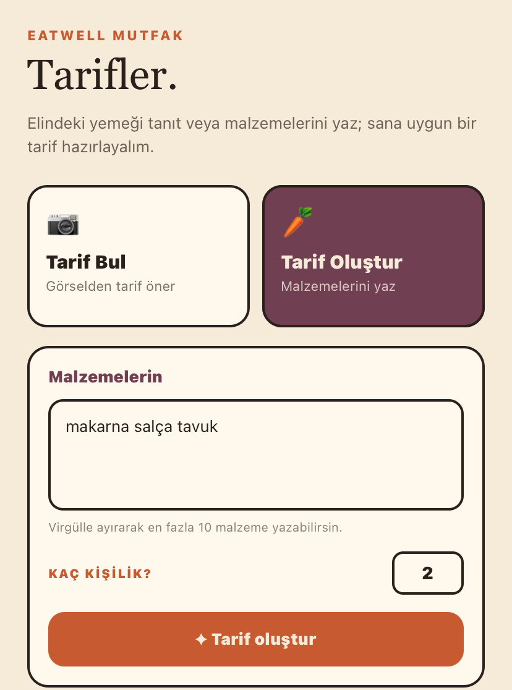</td>
<td valign="top">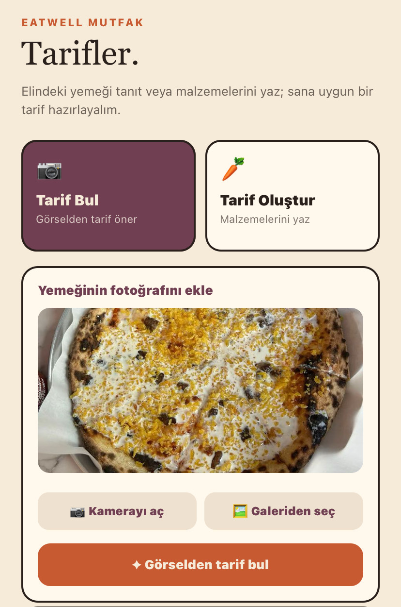</td>
<td valign="top">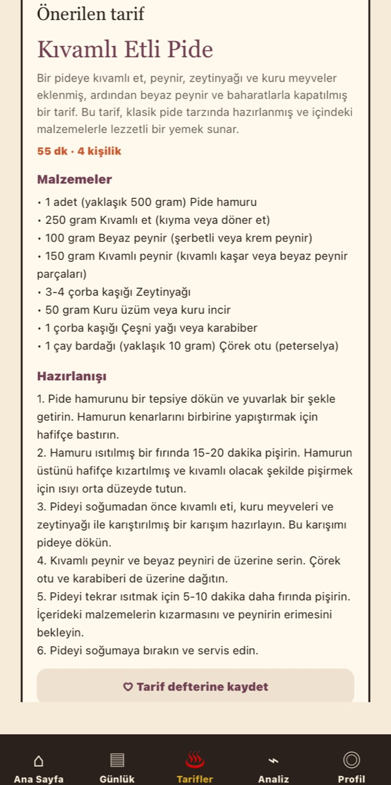</td>
<td valign="top">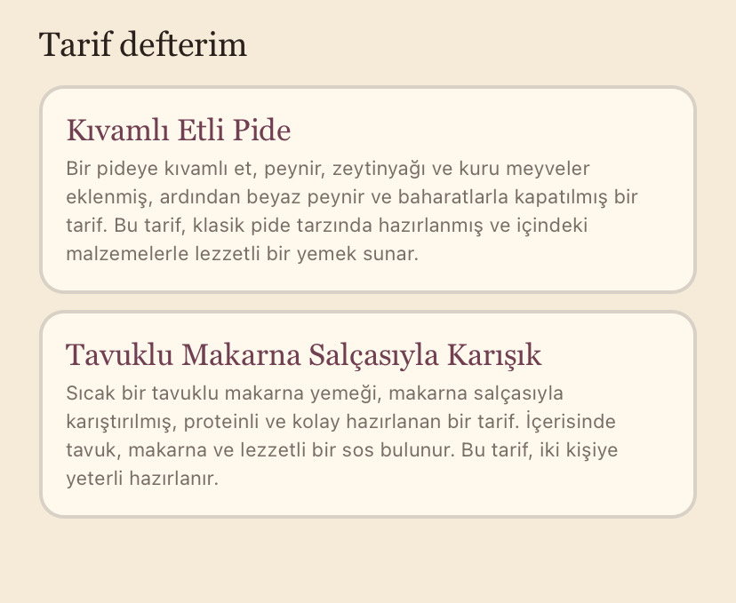</td>
</tr></table>

## 🔌 API ve Swagger

Backend çalışırken Swagger UI:

```text
http://localhost:5248/swagger
```

OpenAPI JSON:

```text
http://localhost:5248/swagger/v1/swagger.json
```

Korumalı endpoint’lerde Firebase Bearer token gerekir.

### Sağlık

| Method | Endpoint | Açıklama |
|---|---|---|
| `GET` | `/api/health` | API sağlık kontrolü |

### Profil ve alerjenler

| Method | Endpoint | Açıklama |
|---|---|---|
| `GET` | `/api/profile` | Kullanıcı profilini getirir |
| `PUT` | `/api/profile` | Profil bilgilerini günceller |
| `GET` | `/api/profile/allergens` | Alerjenleri getirir |
| `PUT` | `/api/profile/allergens` | Alerjen listesini değiştirir |

### Beslenme hedefleri

| Method | Endpoint | Açıklama |
|---|---|---|
| `GET` | `/api/nutrition-goals` | Aktif hedefi getirir |
| `PUT` | `/api/nutrition-goals/manual` | Manuel hedefi kaydeder |
| `POST` | `/api/nutrition-goals/calculate-with-ai` | AI hedef önerisi üretir |
| `PUT` | `/api/nutrition-goals/confirm-ai` | AI önerisini aktif hedef yapar |

### Günlük kayıtlar

| Method | Endpoint | Açıklama |
|---|---|---|
| `GET` | `/api/daily-logs?date=YYYY-MM-DD` | Günün öğünlerini getirir |
| `GET` | `/api/daily-logs/summary?date=YYYY-MM-DD` | Kalori/makro/su özetini getirir |
| `GET` | `/api/daily-logs/history?fromDate=YYYY-MM-DD&toDate=YYYY-MM-DD` | Tarih aralığı geçmişi |
| `POST` | `/api/daily-logs/items` | Öğün besini ekler |
| `PUT` | `/api/daily-logs/items/{itemId}` | Besin gramını günceller |
| `DELETE` | `/api/daily-logs/items/{itemId}` | Öğün besinini siler |
| `POST` | `/api/daily-logs/water` | Su tüketimi ekler |
| `DELETE` | `/api/daily-logs/water` | Su tüketimini azaltır |

### Besin, barkod ve AI

| Method | Endpoint | Açıklama |
|---|---|---|
| `GET` | `/api/foods/search?query=...` | Open Food Facts araması |
| `GET` | `/api/foods/barcode/{barcode}` | Barkoddan ürün getirir |
| `POST` | `/api/foods/analyze-image` | Görsel gıda analizi yapar |
| `GET` | `/api/foods/recent` | Son kullanılan besinler |
| `GET` | `/api/foods/favorites` | Favori besinler |
| `POST` | `/api/foods/favorites` | Favori ekler |
| `DELETE` | `/api/foods/favorites/{externalId}` | Favori siler |

### Tarifler ve haftalık analiz

| Method | Endpoint | Açıklama |
|---|---|---|
| `POST` | `/api/recipes/generate` | Görsel veya malzemelerle tarif üretir |
| `GET` | `/api/recipes/saved` | Kayıtlı tarifleri getirir |
| `POST` | `/api/recipes/saved` | Tarif kaydeder |
| `DELETE` | `/api/recipes/saved/{id}` | Tarif siler |
| `GET` | `/api/analytics/weekly-summary?weekStart=YYYY-MM-DD` | Haftalık gerçek kayıt analizi |

## 🚀 Çalıştırma

### Gereksinimler

- .NET SDK 9+
- Node.js 20+
- PostgreSQL ve Redis
- Firebase projesi
- Mistral API anahtarı

### Backend

Gizli anahtarları repoya koymadan environment variable veya User Secrets kullan:

```powershell
dotnet user-secrets --project backend/src/EatWell.Api set "Mistral:ApiKey" "YOUR_MISTRAL_API_KEY"
dotnet run --project backend/src/EatWell.Api --urls http://0.0.0.0:5248
```

Kontrol:

```text
http://localhost:5248/api/health
http://localhost:5248/swagger
```

### Mobil

`mobile-app/.env`:

```env
EXPO_PUBLIC_API_BASE_URL=http://YOUR_LOCAL_IP:5248
```

Fiziksel telefonda `localhost` yerine bilgisayarının aynı Wi-Fi üzerindeki yerel IP adresini kullan:

```powershell
cd mobile-app
npm install
npx expo start -c
```

## 🔒 Güvenlik

- Mistral anahtarı yalnızca backend’de tutulmalıdır.
- Firebase ID token backend tarafından doğrulanır.
- AI ve dış servis endpointleri rate limit ile korunur.
- Dış isteklerde retry, timeout ve circuit breaker politikaları vardır.
- Kullanıcı verileri `UserId` üzerinden ayrıştırılır.
- Swagger production ortamında erişim politikasıyla sınırlandırılmalıdır.

## 🧪 Doğrulama

```powershell
cd mobile-app
npx tsc --noEmit

dotnet build backend/src/EatWell.Api/EatWell.Api.csproj
```

## 📸 Ekranlar

### Kimlik ve onboarding

<table><tr>
<td valign="top">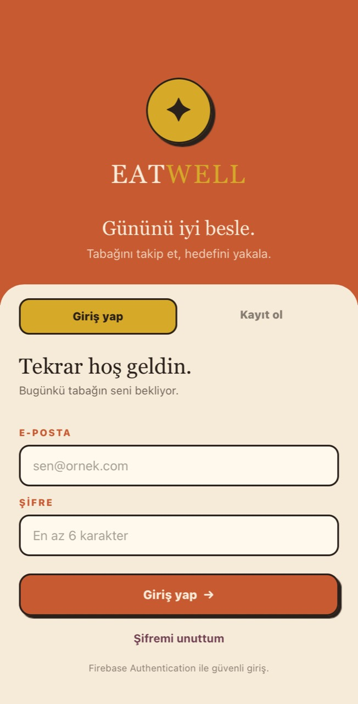</td>
<td valign="top"></td>
<td valign="top"></td>
<td valign="top"></td>
</tr></table>

### Ürün analizi ve tarifler

<table><tr>
<td valign="top"></td>
<td valign="top"></td>
<td valign="top"></td>
<td valign="top"></td>
</tr></table>

## 📄 Lisans

Bu depo geliştirme ve eğitim amaçlı EatWell projesini içerir.
